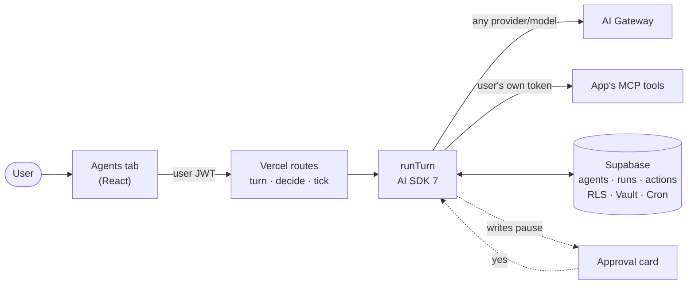

# agent-template

A blank, runtime-agnostic workspace for a long-running business agent: analytics, marketing, operations. Copy it, point your agent runtime at it, and the agent fills in the rest during its first conversation.

## Agent Kit (design)

This repo also holds the design for **Agent Kit**: an open-source way to give any Vite + Supabase + Vercel app an Agents tab, with built-in agents, agents users create themselves, any model, the app's own permissions, and a human yes before any write.



| Doc | What's in it |
|---|---|
| [Architecture](docs/architecture.md) | Principles, system and component diagrams, chat and schedule sequences, approval state machine, data model, security model, decision log |
| [Schema](docs/schema.sql) | Full Postgres DDL with RLS policies, append-only versions, double-fire protection, the Cron job |
| [Reference code](docs/reference/) | `runTurn`, the turn/decide/tick routes and the chat UI with approval cards. Sketches, but they typecheck against the real packages |
| [Build plan](docs/build-plan.md) | Milestones, success criteria and the real-run test scenarios for the engineer who builds it |

Status: designed and validated against current versions (AI SDK 7, MCP 2026-07-28, Supabase, Vercel AI Gateway); not yet built.

## Layout
```
BOOTSTRAP.md              first conversation; the agent deletes it when done
SOUL.md  IDENTITY.md      who the agent is
USER.md                   who it's helping
AGENTS.md                 operating manual: session start, memory, safety, quality, heartbeats
MEMORY.md                 curated long-term memory (main session only)
HEARTBEAT.md              checklist the 30m heartbeat runs
TOOLS.md                  setup-specific tool notes
PROACTIVE_PREFERENCES.md  what to surface unprompted, and when
memory/                   daily notes, people/, groups/
dreams/                   nightly reflections
goals/                    one folder per long-running goal
cron.d/                   routines, one file each
self_improvement/         background passes
skills/                   SKILL.md library
agents/                   optional specialist agents
config/agent.example.json runtime config shape, placeholders only
.mcp.json                 connectors: Slack, Google Drive, GitHub, Stripe
```

## Use
1. Copy (or "Use this template" on GitHub) into a new **private** repo or folder.
2. Copy `config/agent.example.json` to `config/agent.json` and fill it for your runtime. Secrets go in env vars, never the file.
3. Point the runtime's workspace at the folder. Claude Code: open it as the project; `AGENTS.md` + `skills/` work as-is. Other runtimes: set it as the agent workspace.
4. Connectors in `.mcp.json` sign in with OAuth on first use (Google, Slack, Stripe); GitHub reads `GITHUB_PERSONAL_ACCESS_TOKEN` from env. Delete any you won't use. Add your own data connector (warehouse, BI tool, or your app's MCP); it's what the analysis skills query.
5. Start a conversation. The agent runs `BOOTSTRAP.md`.

## Keeping it a template
Once a copy has real memory in it, it's personal; don't push it back here. To share an improved setup, ask the agent to run `skills/export-template`, then:

```
./scripts/check-clean.sh
```

which fails on emails, phone numbers, and common token shapes.

## License
Apache-2.0 (see `LICENSE`). The Slack skills are MIT, from Slack's plugin (see `skills/LICENSE-slack-skills`).
