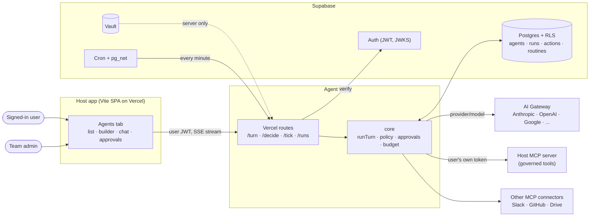
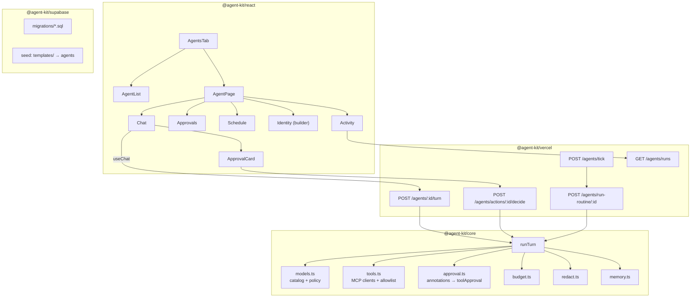
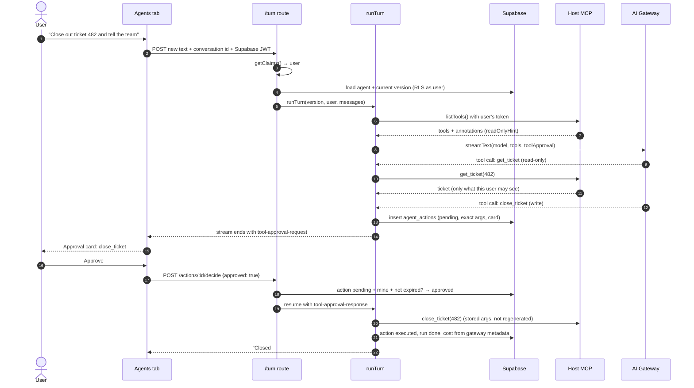
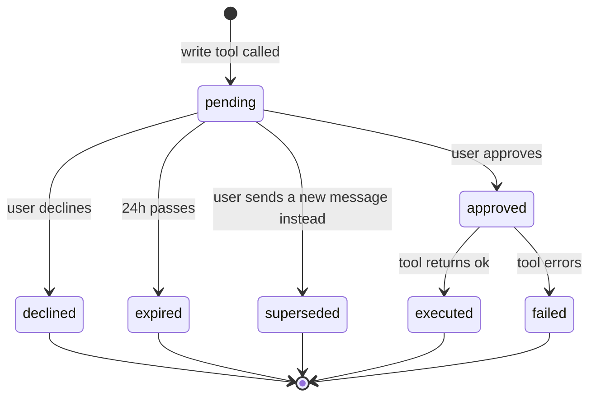
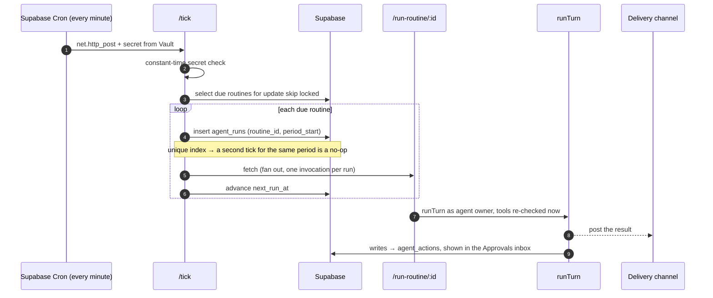
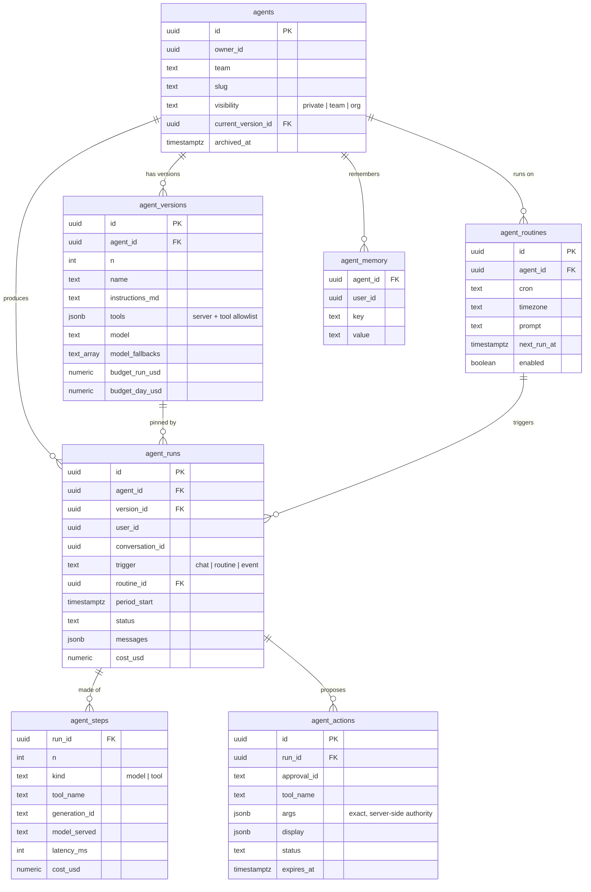

# Agent Kit: Architecture

Agent Kit adds an **Agents tab** to any Vite + Supabase + Vercel app: built-in agents, agents your users create themselves, any model, the app's own permissions, and a human yes before anything leaves the building.

It is deliberately thin. The hard parts come from libraries that already solve them; Agent Kit is the schema, the policy, and the glue.

| Concern | Provided by |
|---|---|
| Agent loop, tool calling, tool approval, MCP client | [AI SDK 7](https://ai-sdk.dev/docs/agents/overview) (`ToolLoopAgent`, `toolApproval`, `createMCPClient`) |
| Any model, failover, budgets, cost logs | [Vercel AI Gateway](https://vercel.com/docs/ai-gateway) |
| Auth, data, row-level security, secrets, scheduling | [Supabase](https://supabase.com/docs) (Auth, Postgres RLS, Vault, Cron + `pg_net`) |
| Hosting and request handling | Vercel Functions (Fluid compute, up to 800s on Pro) |
| What the agent can see and do | The host app's own MCP server(s) |
| What an agent *is* | The workspace format in this repo's `templates/` |

---

## 1. Design principles

1. **An agent is data, not code.** One row per agent, an immutable row per version. Users create agents without a deploy.
2. **Never more powerful than its user.** Every tool call carries the calling user's own token. The host's existing access rules decide what comes back.
3. **Writes are proposals.** A tool that changes anything pauses the run and becomes a card. Nothing executes until a person approves, and what executes is exactly what the card showed.
4. **Fail closed.** A tool is treated as a write unless its MCP annotations say `readOnlyHint: true`. A model is refused unless it's in the catalog.
5. **Any model, one line.** Models are `provider/model` strings. Swapping one is a field in the builder.
6. **No new infrastructure.** Postgres, a few Vercel routes, a React component. No queue service, no worker fleet, no vector DB in v0.1.

---

## 2. System context



---

## 3. Components



**The one function that matters:**

```ts
runTurn({ agentVersion, user, messages, trigger, host }): ReadableStream

// The host app supplies five things. Everything else is generic.
interface Host {
  servers: Record<string, McpServer>                                 // the only MCP servers agents can reach
  getToolToken(user: User, server: McpServer): Promise<string>       // usually: the user's Supabase JWT
  canUseTool(user: User, server: string, tool: string): Promise<boolean>
  canSeeTeam(user: User, team: string | null): Promise<boolean>      // mirrors the app's RLS
  db: SupabaseClient                                                 // service role, server only
}
```

See [`reference/core/run-turn.ts`](reference/core/run-turn.ts) for the full sketch.

---

## 4. A chat turn, with a write



Step 21 is the point of the design: the executed arguments come from the stored tool call. The model never gets a second chance to change what was approved.

---

## 5. Approval lifecycle



Only the `decide` route moves an action out of `pending`. Clients can read actions, never update them.

---

## 6. A scheduled routine



Defaults inherited from the template's `routines` skill: weekdays during waking hours, never on :00 or :30, and finite watches expire on their own.

---

## 7. Data model



Full DDL with RLS policies: [`schema.sql`](schema.sql).

---

## 8. Security model

| Threat | Control |
|---|---|
| Agent reads data its user can't | Every MCP call carries the user's own JWT; the host's access rules run unchanged. Scheduled runs re-check the owner's access when they fire, not when they were saved. |
| User-made agent points a tool at its own server | Versions store a server **id**; only servers in the host's registry are ever dialed. A URL in agent data is never used, so no token goes to an arbitrary host and nothing internal is reachable. |
| Agent borrows another agent's private version | Composite foreign key: an agent's current version must belong to that agent. |
| Owner shares an agent past review | Widening visibility, changing team or owner, and skipping approval on a write tool are admin-only (enforced by triggers, not the UI). |
| Client forges history to skip approval | The client sends only new text and a conversation id. History, tool calls and approval responses come from the server's own run records. |
| Shared agent's owner reads viewers' chats | Runs are visible only to the user who ran them. |
| Owner edits a shared agent after review | Changing the live version of a non-private agent is a re-publish and needs an admin. |
| Routine posts somewhere it shouldn't | Delivery targets are channel ids from the host's registry; anything else is never posted to. |
| Agent changes something nobody approved | Write tools never execute inside the loop. `agent_actions` holds the exact args; only `/decide` can move an action. It confirms the caller owns the run **before** touching the row, then updates only if still pending and unexpired. |
| Model changes the action after approval | Execution uses the stored tool call. The model isn't re-asked. |
| User-made agent smuggles instructions | Tool output is data, never instructions. Builder only lists tools the creator holds. Sharing re-checks each viewer at run time. Publishing to a team needs an admin. |
| Secrets leak to model or browser | Keys live in Vault and route env only. Key-shaped strings in user input are masked before the model or logs see them. Only the publishable Supabase key reaches the browser. |
| Private data sent to a model that trains on it | `models.json` flags `trainsOnData`; such models are refused for any agent with tools. Test-enforced. |
| Runaway spend | Per-run and per-day caps checked before every step; Gateway budgets as the outer fence. |
| Double-fired schedules | Unique index on `(routine_id, period_start)`. |

---

## 9. Model policy

```json
// models.json (excerpt)
{
  "anthropic/claude-sonnet-5.5": { "jobs": ["chat", "analysis", "routine"], "trainsOnData": false, "zdr": true },
  "openai/gpt-5-mini":           { "jobs": ["chat", "routine"],             "trainsOnData": false, "zdr": true },
  "example/free-model":          { "jobs": ["chat"],                        "trainsOnData": true,  "zdr": false }
}
```

- The agent's `model` must be in the catalog; `model_fallbacks` go to the Gateway as `providerOptions.gateway.models`.
- **Auto** picks the first catalog model allowed for the agent's job that has passed the agent's eval set.
- Cost per step comes from `providerMetadata.gateway.cost`; `generationId` ties each step to the Gateway's own request log.

---

## 10. The Agents tab

```
┌─ Agents ───────────────────────┬──────────────────────────────────────────────┐
│ + New agent                    │            (avatar)  ● Available             │
│                                │   Weekly Digest                              │
│ ● Lead        Available        │   Summarizes the week for your team          │
│   Plans with you, delegates    │   sonnet-5.5 · 1.2k tok · 4 turns · $0.03    │
│                                │        [ Message ]                           │
│ ● Weekly Digest   Done         │ ┌──────────┬───────────┬──────────┬────────┐ │
│   "Sent to #team, 3 items"     │ │ Activity │ Approvals │ Schedule │Identity│ │
│   sonnet-5.5 · $0.03           │ └──────────┴───────────┴──────────┴────────┘ │
│                                │  Today                                       │
│ ● Ticket Triage  Needs you     │   ↗ Posted the digest to #team     9:47 AM   │
│   "Close #482?"                │   ⏸ Wants to close #482 → Approve / Decline  │
│   gpt-5-mini · $0.01           │  Yesterday                                   │
│                                │   ↗ No new items, said so          9:47 AM   │
└────────────────────────────────┴──────────────────────────────────────────────┘
```

- **List:** status chip and meta line come straight from the latest `agent_runs` row, so there's no separate status service to keep honest.
- **Identity** is the builder: instructions, tools (only ones you hold), model (Auto by default), budget, visibility, and a test pane. Every save is a new version.
- **Schedule** shows routines in plain words ("Weekdays at 9:47am, posts to #team") with pause and run-now.

---

## 11. Why these choices

| Decision | Chosen | Considered | Why |
|---|---|---|---|
| Agent loop | AI SDK 7 `ToolLoopAgent` | Hand-rolled loop, LangChain | Model-agnostic, native approval and MCP, streams to React with `useChat` |
| Durable execution | None in v0.1 | Workflow SDK, Postgres queue | Approval stop/resume is built into AI SDK; 800s covers a turn. Add Workflow when a run outgrows it |
| Agent framework | Thin layer of our own | Vercel eve | eve fits well (folder-shaped agents, runtime `defineDynamic`), but it's in preview. The template stays eve-compatible to keep the door open |
| Models | AI Gateway | OpenRouter, LiteLLM | Native to Vercel: failover, budgets and per-request cost included. The other two are drop-ins |
| Scheduling | Supabase Cron + `pg_net` | Vercel Cron, queue service | One-minute resolution, lives next to the data, secrets in Vault |
| Which tools are writes | MCP `readOnlyHint` | Hand-kept list | A standard the tool's own author sets; unknown means write |
| Tool auth | Forward the user's JWT | Service token, minted tokens | Can't exceed the user by construction; nothing new to rotate |

---

## 12. Validated assumptions

Checked with throwaway scripts against real models before this design was finalized (2026-10-06, `ai@7.0.128`, `@ai-sdk/mcp@2.0.67`, `@modelcontextprotocol/sdk@1.32.1`):

- A write tool marked for approval paused with zero executions; the saved run survived a JSON round trip; approving executed exactly the stored args. Identical on an Anthropic and an OpenAI model.
- MCP annotations are **not** on AI SDK tool objects. Read them from `mcp.listTools()`.
- Gateway returns per-request `cost` and `generationId` in `providerMetadata.gateway`; fallbacks via `providerOptions.gateway.models`.
- A secret-gated route on a Vercel production domain answered every scheduler-style call; preview URLs sit behind deployment protection, so cron must target production.

---

## 13. Roadmap after v0.1

- **Lead agent** that plans with the user and delegates with one `send_to_agent` tool.
- **Durable runs** (Workflow SDK `WorkflowAgent`) when a run exceeds 800s or needs to wait days.
- **Event triggers:** Slack mention, GitHub CI, inbound email, webhook.
- **Semantic memory** with pgvector once per-user memory outgrows the prompt.
- **Coding agents** in sandboxes for repo work.
- **Background passes** from the template: memory upkeep, skill review, nightly reflection.

Build plan and acceptance tests: [`build-plan.md`](build-plan.md).
